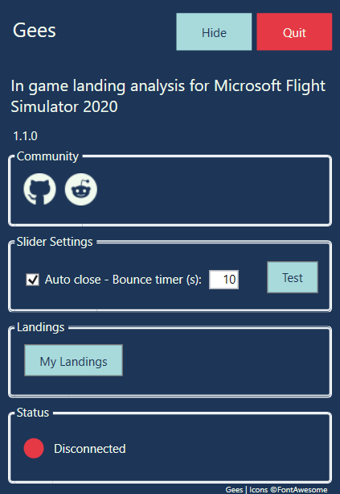
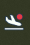
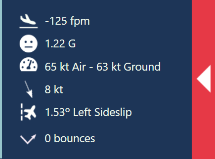
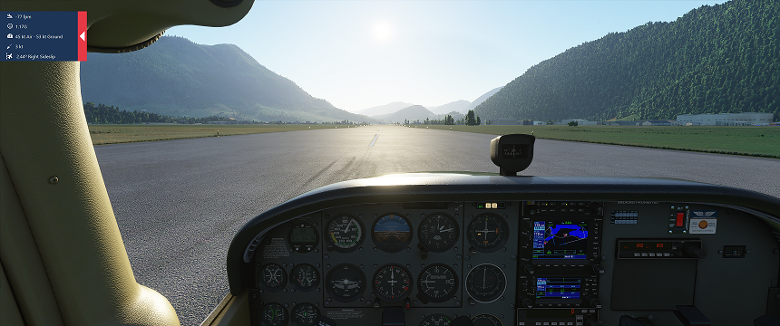

<!-- PROJECT LOGO -->
<br />
<p align="center">
  

  <h1 align="center">Gees</h3>

  <p align="center">
  In game landing analysis for Microsoft Flight Simulator 2020.
</p>

## Update
Check out the new in-game panel – it's more convenient and comes with some cool updates.

https://flightsim.to/product/gees-landing-analysis-for-msfs

or

https://secure.simmarket.com/gees-gees-msfs.phtml

## How to Install/Use?
Download the latest release from [here](https://github.com/scelts/msfslandingrate/releases) (Assets -> File-that-is-not-source-code.zip). Unzip to your favorite location for MSFS2020 landing monitors, and start ```Gees.exe```. 
You'll see a window like this in the bottom right. 



The app itself runs in the background, and you can find this status window in the status tray, as this icon:



That's it. When you start the sim the app will automatically connect and when you land, you'll get a window similar to this slide out top-left:




You can start it before, or after the MSFS, it doesn't matter.

## How to Uninstall?
Delete the folder where the Gees.exe resides.
## What is measured?
### Descent rate at the landing in feet per minute
Self explanatory.
### G force at the touchdown
Maximum G force impact at the moment of touchdown. Should be in theory related to the descent rate, undercarriage dampers and how much the passengers are nervous.
### Airspeed and ground speed at the touchdown
Self explanatory.
### Wind speed and direction at the touchdown
There's a nice arrow, showing where the wind is blowing from
### Sideslip at the touchdown
Did you do the proper de-crab maneuver, or the plane is going sideways on touchdown in the crosswind? The higher, the worse. Keep it close to 0 degrees or you might break the gear, or pop the tire (well, probably not in the sim).
### Bounces
In cases where you want to land, but the plane says "nope, I'm still flying", all the measures are taken from the first touchdown, and all subsequent ones are counted as bounces.
## How to compile it
It's a c# WPF application. You'll need a Visual Studio with .NET 4.7 and the following nuget libraries:
```
CTrue.FsConnect
Octokit
PrettyBin
CsvHelper
```
## Contact
Use the [reddit page](https://www.reddit.com/r/MSFS2020LandingRate), or here, the [Issues page](https://github.com/scelts/msfslandingrate/issues) to report bugs and suggestions. Please do.


## License
Distributed under the GNU General Public License v3.0 License. See `LICENSE` for more information. (Whatever you do with this, keep it open source)
